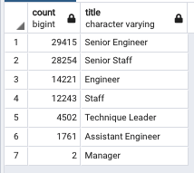
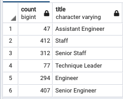

# Pewlett-Hackard-Analysis

## Overview:
The following analysis, performed for the company Pewlett-Hackard, was to determine the following:
  1. Determine, per title, the number of employees in the process of retiring
  2. Find and identify the employees who are eligible to participate in the mentorship program in an effort to match them with rising employees on track to be their replacements
  3. Based on the information collected, utiize these findings to prepare for the moment when many employees will be retiring around the same time frame
  
## Analysis Results:
Based on the results:
 - 90,398 titles of individuals will be retiring from the company soon based on the date of birth of 1/01/1952 and 12/31/1955

  

 - Only 1,549 of them qualify for the mentorship program, a program designed to mentor and train their future replacements

  

 - The Membership Eligibility Program only qualifies retiring individuals born between January 1, 1965 and December 31, 1965, giving a very short window of time to be eligible to mentor rising employees

  - The highest technical positions are the positions lacking the most replacements, by the thousands,  and would require the greatest training:
    - Senior Engineers
    - Senion Staff
    - Engineers
   

## Analysis Summary:

To summarize, Pewlett-Packertt is severely behind on replacing valuable employees approaching retirement. As visible in both tables above in the summary, the first table shows that there are over 90,000 employees headed to retirement, and the second table shows that only about 1,500 of them qualify for the mentorship program, and the program allows qualification for only 1 specified birth year for every employee. It is the positions that are the heart of the company that need the most replacements (Senior Engineers, Engineers, Senior Staff), that if they are not replaced and not replaced properly, it could place the company in grave jeopardy. As a result, the following questions must be answered:

1. How many roles will need to be filled as the "silver tsunami" begins to make an impact?
   - In order to meet the "silver tsunami", 88,849 roles will need to be filled very soon.

2. Are there enough qualified, retirement-ready employees in the departments to mentor the next generation of Pewlett Hackard employees?
   - There are not enough qualified and retirement-ready employees in the department to mentor the next generation of Pewlett Hackard employees. The mentorship only lasts 1 year of a specified birth year so the company is providing very limited room for themselves and the soon-to-be retirees to get rising employees on board and fully trained for the positions that are to open up.

In conclusion, if Pewlett-Hackard really wanted to prepare for the "silver tsunami", they will need to greatly expand their mentorship program beyond just those born in 1965, (the latest year to retire), they should expand it to a multi-year window and provide flexibility within the workday for employees to train their mentees. Surely there are many young employees who would appreciate and take advantage of the training/mentorship. If Pewlett-Hackard do not  take advantage of this time, they will be looking at a very big career fair within the next couple of years and more. 

